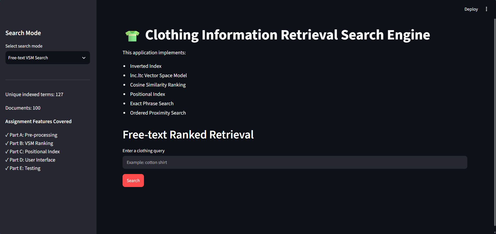
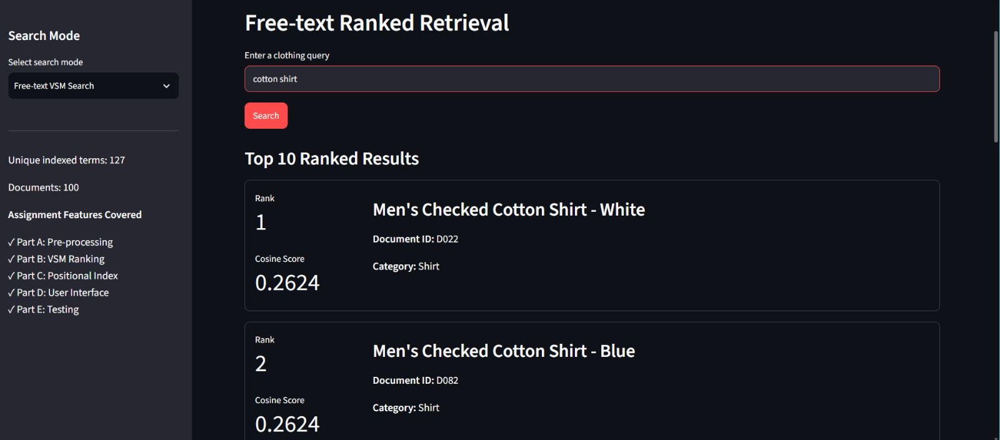
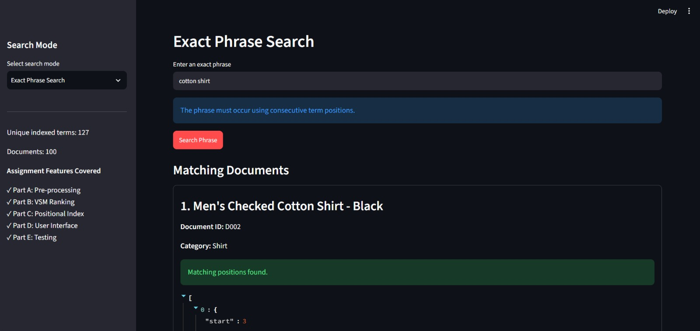
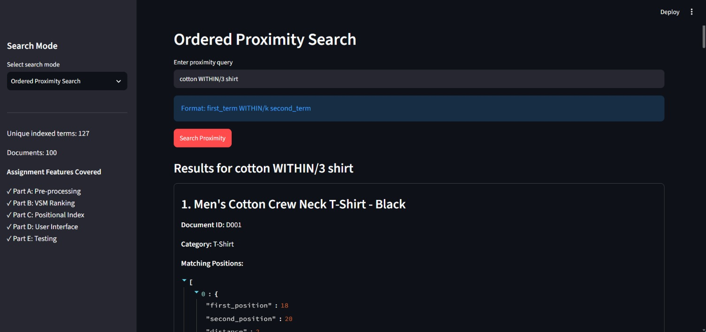
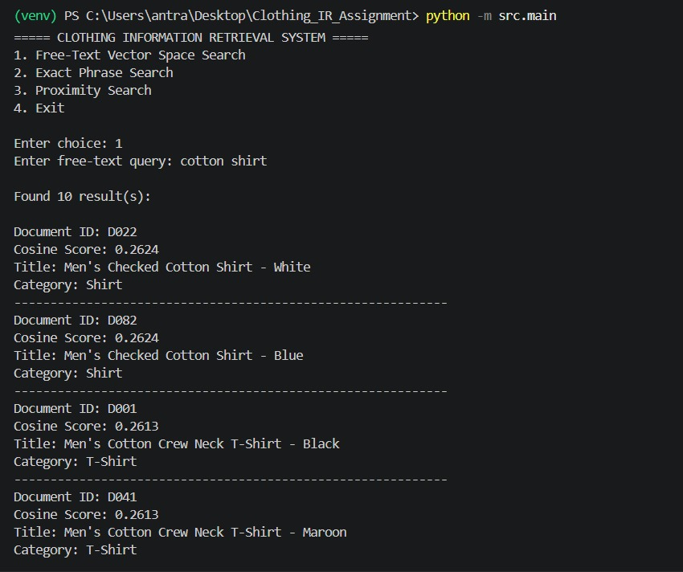
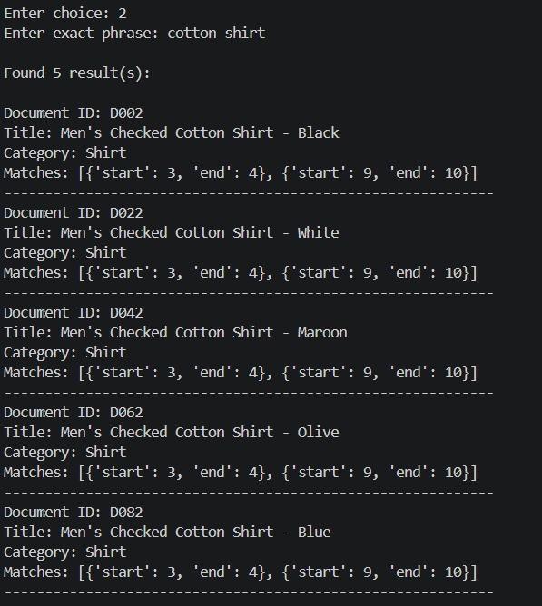
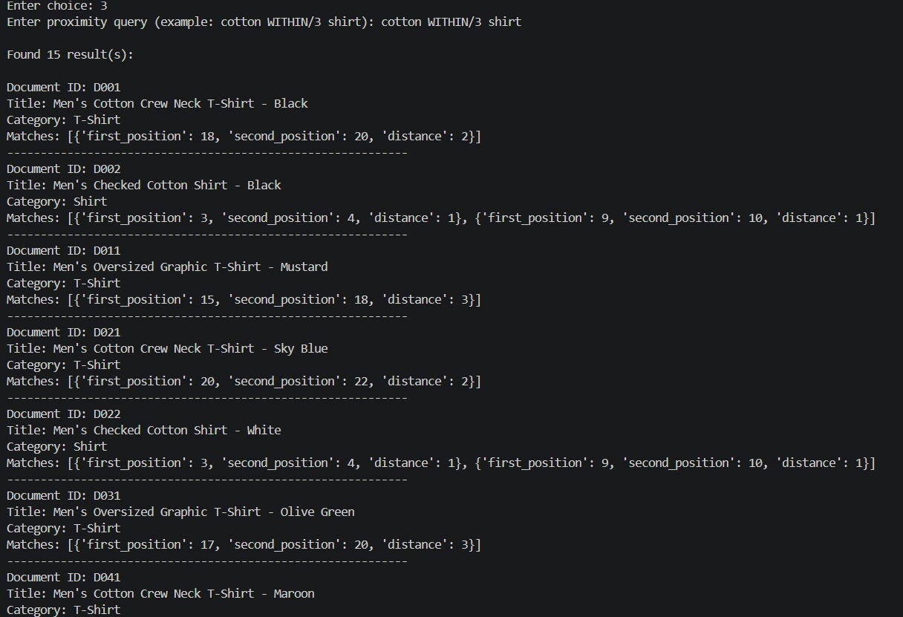

# Complete Project Documentation

# Clothing Information Retrieval System

## 1. Purpose of This Document

This document explains the Clothing Information Retrieval System from
the beginning so that a reader with no prior knowledge of the project
can understand its purpose, internal design, algorithms, file structure,
execution steps, and results.

The project is an academic Information Retrieval system built over a
corpus of 100 clothing-product documents. It demonstrates both
conventional ranked retrieval and position-aware retrieval. It also
includes a clothing-domain novelty feature that expands selected
clothing terms with related vocabulary and explains why results were
returned.

------------------------------------------------------------------------

## 2. What Problem Does the Project Solve?

A clothing catalogue contains many product descriptions. A user may want
to search for products using words such as:

-   `cotton shirt`
-   `black jacket`
-   `comfortable shoes`

A simple keyword lookup is not enough because it does not answer all of
the following questions:

1.  Which documents contain the query terms?
2.  Which matching documents are most relevant?
3.  Do the query words appear next to each other as a phrase?
4.  Do the query words appear close to each other in the correct order?
5.  Can related clothing vocabulary help retrieve useful products?
6.  Can the system explain why a particular product was retrieved?

This project answers these questions using an inverted index, TF-IDF
cosine similarity, a positional index, exact phrase search, ordered
proximity search, and explainable query expansion.

------------------------------------------------------------------------

## 3. Learning Objectives

After studying this project, a reader should understand:

-   Why preprocessing is necessary in Information Retrieval.
-   How an inverted index speeds up term-based search.
-   How document frequency and inverse document frequency affect
    ranking.
-   How cosine similarity compares a query with document vectors.
-   Why positional indexes are required for phrase and proximity
    queries.
-   How exact phrase retrieval differs from ordinary ranked retrieval.
-   How ordered proximity retrieval works.
-   How a CLI and Streamlit interface connect to the retrieval engine.
-   How automated tests demonstrate correctness.
-   How a domain-specific novelty layer can improve search flexibility
    without changing the original positional semantics.

------------------------------------------------------------------------

## 4. System at a Glance

The system follows this overall workflow:

``` text
                         OFFLINE INDEXING

corpus_100.txt
      |
      v
Parse <DOC> blocks
      |
      v
Extract DOCID, CATEGORY, TITLE, TEXT
      |
      v
Preprocess title + text
(lowercase, tokenize, stop-word removal, stemming)
      |
      +--------------------------+
      |                          |
      v                          v
Inverted Index              Positional Index
(term -> postings)          (term -> positions)
      |                          |
      +------------+-------------+
                   |
                   v
       JSON index files and metadata
                   |
                   v

                         ONLINE RETRIEVAL

User Query
    |
    +-------------------+--------------------+--------------------+
    |                   |                    |                    |
    v                   v                    v                    v
Free-text VSM      Exact Phrase       Ordered Proximity    Smart Clothing
    |                   |                    |                    |
    v                   v                    v                    v
lnc.ltc weights    Consecutive          Position difference   Expand selected
and cosine         positions            0 < p2-p1 <= k       clothing terms
similarity         required             required             and weight them
    |                   |                    |                    |
    +-------------------+--------------------+--------------------+
                                |
                                v
                         Results and explanations
```

------------------------------------------------------------------------

## 5. Main Components

  -----------------------------------------------------------------------
  Component                           Purpose
  ----------------------------------- -----------------------------------
  `corpus_100.txt`                    Source collection containing 100
                                      clothing documents

  `src/preprocess.py`                 Converts raw text into normalized
                                      terms

  `src/indexer.py`                    Parses the corpus and builds all
                                      indexes

  `data/inverted_index.json`          Stores term frequencies and
                                      document postings

  `data/positional_index.json`        Stores term positions for
                                      phrase/proximity search

  `data/document_metadata.json`       Stores titles, categories, and
                                      original text

  `src/retrieval.py`                  Implements VSM ranking and smart
                                      retrieval

  `src/positional_search.py`          Implements phrase and ordered
                                      proximity retrieval

  `src/query_expansion.py`            Defines clothing synonyms and
                                      expands queries

  `src/relevance_feedback.py`         Implements Rocchio relevance
                                      feedback query reformulation

  `src/main.py`                       Command-line interface

  `app/app.py`                        Streamlit web interface

  `tests/run_tests.py`                Runs the evaluation suite

  `tests/test_results.txt`            Stores generated test output

  `screenshots/`                      Stores visual evidence of the
                                      implemented features
  -----------------------------------------------------------------------

------------------------------------------------------------------------

## 6. Dataset and Document Format

The corpus contains 100 clothing-product documents. Each document is
represented using XML-style tags:

``` xml
<DOC>
    <DOCID>D001</DOCID>
    <CATEGORY>Shirt</CATEGORY>
    <TITLE>Example Cotton Shirt</TITLE>
    <TEXT>Comfortable cotton shirt for everyday wear.</TEXT>
</DOC>
```

The indexer extracts four fields:

-   `DOCID`: unique document identifier.
-   `CATEGORY`: product category.
-   `TITLE`: product name.
-   `TEXT`: product description.

The title and description are joined before preprocessing:

``` text
TITLE + " " + TEXT
```

Therefore, a term appearing in either the title or description can
participate in ordinary, phrase, or proximity retrieval.

Documents are sorted using the numeric part of their IDs. For example:

``` text
D001 -> 1
D002 -> 2
D100 -> 100
```

This numeric order is also used as the tie-breaker when VSM scores are
equal.

------------------------------------------------------------------------

## 7. Text Preprocessing

Documents and queries must be represented in the same way. If documents
are indexed as raw words but queries are stemmed, matching becomes
inconsistent. The project therefore uses the same normalization pipeline
for both.

### 7.1 Lowercasing

All text is converted to lowercase.

``` text
Cotton Shirt
```

becomes:

``` text
cotton shirt
```

This prevents capitalization differences from creating separate terms.

### 7.2 Punctuation Removal and Tokenization

Non-alphanumeric separators are replaced with spaces, and the remaining
text is split into tokens.

Example:

``` text
Women's Cotton Shirts!
```

is tokenized approximately as:

``` text
women, s, cotton, shirts
```

### 7.3 Stop-Word Removal

A manually defined English stop-word list removes common words such as:

``` text
a, an, the, and, or, in, on, with, is, are, this, that
```

Stop-word removal reduces noise and keeps the index focused on
content-bearing terms.

### 7.4 Porter Stemming

The project uses NLTK's `PorterStemmer`.

Stemming reduces related word forms to a common representation. For
example:

``` text
shirts -> shirt
```

The exact output is determined by the Porter stemming algorithm.

### 7.5 Final Example

``` text
Original:
Women's Cotton Shirts!

Normalized representation:
womens cotton shirt
```

The exact internal representation should be treated as the output of the
implemented tokenizer, stop-word policy, and Porter stemmer.

### 7.6 Preprocessing Function

The main public functions are:

``` python
tokenize(text)
normalize_tokens(text)
normalize_query(query)
```

`normalize_query()` uses the same pipeline as documents.

------------------------------------------------------------------------

## 8. Building the Indexes

Indexing is an offline preparation step. Instead of scanning all 100
documents for every query, the system reads the corpus once and creates
reusable structures.

### 8.1 Corpus Parsing

`src/indexer.py`:

1.  Reads `corpus_100.txt`.
2.  Finds every `<DOC> ... </DOC>` block.
3.  Extracts the document fields.
4.  Sorts the documents.
5.  Passes them to the index-building function.

### 8.2 Inverted Index Construction

For every normalized term in a document, the indexer records:

-   The document frequency `df`.
-   Every document containing the term.
-   The term frequency `tf` inside that document.

Conceptual structure:

``` text
term
 ├── df
 └── postings
      ├── doc_id
      └── tf
```

Example:

``` json
{
  "cotton": {
    "df": 20,
    "postings": [
      {"doc_id": "D001", "tf": 2},
      {"doc_id": "D002", "tf": 1}
    ]
  }
}
```

### 8.3 Positional Index Construction

The positional index stores all information needed for phrase and
proximity queries.

For each normalized term, it records:

-   Document frequency.
-   Document ID.
-   Term frequency.
-   Every token position in the document.

Example:

``` json
{
  "cotton": {
    "df": 20,
    "postings": [
      {
        "doc_id": "D001",
        "tf": 2,
        "positions": [3, 18]
      }
    ]
  }
}
```

Positions are zero-based because the indexer uses Python's
`enumerate()`.

### 8.4 Metadata File

The metadata file maps each document ID to:

``` json
{
  "title": "...",
  "category": "...",
  "text": "..."
}
```

The retrieval functions use this file to display readable product
information instead of only returning document IDs.

### 8.5 Generated Files

Running the indexer creates:

``` text
data/inverted_index.json
data/positional_index.json
data/document_metadata.json
```

------------------------------------------------------------------------

## 9. Vector-Space Retrieval Model

The ordinary free-text search uses the Vector Space Model.

Each document and query is represented as a vector of term weights.
Documents are ranked according to cosine similarity with the query
vector.

The implementation uses the `lnc.ltc` weighting scheme.

### 9.1 Meaning of `lnc.ltc`

The three letters describe the document-side weighting:

-   `l`: logarithmic term frequency.
-   `n`: no inverse document frequency.
-   `c`: cosine normalization.

The query-side weighting is:

-   `l`: logarithmic term frequency.
-   `t`: inverse document frequency.
-   `c`: cosine normalization.

### 9.2 Document Weight

For a term with frequency `tf` in a document:

``` text
w(t,d) = 1 + log10(tf)
```

No IDF is applied to the document weight.

### 9.3 Query Weight

For a query term:

``` text
w(t,q) = (1 + log10(tf)) × log10(N / df)
```

where:

-   `N = 100`
-   `tf` is the term frequency in the query.
-   `df` is the number of documents containing the term.

Terms not present in the inverted index are ignored by the query vector.

### 9.4 Cosine Normalization

For a vector containing weights `w1, w2, ...`:

``` text
magnitude = sqrt(w1² + w2² + ...)
```

Each weight is divided by the magnitude.

This prevents longer documents or queries from receiving an unfair
advantage only because they contain more terms.

### 9.5 Cosine Similarity

For normalized query vector `q` and document vector `d`:

``` text
cosine(q,d) = (q · d) / (||q|| × ||d||)
```

Because both vectors are normalized, the implementation effectively
calculates the dot product of the normalized vectors.

### 9.6 Ranking

The system:

1.  Normalizes the query.
2.  Builds the query vector.
3.  Builds normalized document vectors from the inverted index.
4.  Calculates similarity for every indexed document.
5.  Keeps documents with positive scores.
6.  Sorts by descending score.
7.  Uses numeric document ID as a tie-breaker.
8.  Returns the top 10 results.

------------------------------------------------------------------------

## 10. Exact Phrase Retrieval

Ordinary VSM checks whether query terms contribute to a score, but it
does not require them to appear together.

Exact phrase retrieval solves this problem using the positional index.

For:

``` text
cotton shirt
```

the system requires:

``` text
position(shirt) = position(cotton) + 1
```

### Algorithm

1.  Normalize the phrase.
2.  Check that every term exists in the positional index.
3.  Find documents containing all query terms.
4.  For every candidate document, inspect positions of the first term.
5.  Check whether each following term occurs at the next consecutive
    position.
6.  Store every valid start and end position.
7.  Return documents with at least one valid phrase match.

Example:

``` text
matches = [
    {"start": 3, "end": 4},
    {"start": 9, "end": 10}
]
```

A document containing `cotton` and `shirt` far apart does not satisfy an
exact phrase query.

------------------------------------------------------------------------

## 11. Ordered Proximity Retrieval

Proximity retrieval relaxes exact adjacency while preserving term order.

A query is written as:

``` text
first_term WITHIN/k second_term
```

Example:

``` text
cotton WITHIN/3 shirt
```

The matching condition is:

``` text
0 < position(second_term) - position(first_term) <= k
```

### Interpretation

-   `0 < distance` ensures the second term occurs after the first.
-   `distance <= k` enforces the maximum allowed distance.
-   The first and second terms may have intervening words.

### Example

If:

``` text
cotton occurs at position 15
shirt occurs at position 18
```

then:

``` text
distance = 18 - 15 = 3
```

The pair matches:

``` text
WITHIN/3
WITHIN/4
WITHIN/5
```

but not:

``` text
WITHIN/1
WITHIN/2
```

### Query Parsing

`parse_proximity_query()` recognizes patterns such as:

``` text
cotton WITHIN/3 shirt
stretch WITHIN/4 denim
```

The parser returns:

``` text
(first_term, second_term, k)
```

The search function then uses the positional index to find valid ordered
pairs.

### Result Format

A matching result contains:

``` json
{
  "first_position": 15,
  "second_position": 18,
  "distance": 3
}
```

Increasing `k` makes the search less restrictive and can add documents.

------------------------------------------------------------------------

## 12. Novelty Feature: Explainable Smart Clothing Retrieval

The novelty feature is implemented in `src/query_expansion.py` and
integrated into `src/retrieval.py` and `app/app.py`.

Its purpose is to make clothing search more flexible while making the
ranking process easier to understand.

### 12.1 Clothing Synonym Dictionary

The project uses a conservative, manually defined dictionary:

``` python
CLOTHING_SYNONYMS = {
    "shirt": ["top", "blouse", "tee"],
    "pant": ["trouser", "jean", "bottom"],
    "shoe": ["footwear", "sneaker"],
    "dress": ["gown", "frock"],
    "jacket": ["coat", "blazer"],
    "sweatshirt": ["hoodie", "pullover"],
}
```

### 12.2 Query Expansion

For each original query term:

1.  Keep the original normalized term.
2.  Add known synonyms.
3.  Remove duplicate expanded terms.
4.  Assign each term a weight multiplier.

The current design uses:

``` text
original term multiplier = 1.0
synonym term multiplier = 0.35
```

Therefore, an exact original match is stronger than a synonym-only
match.

### 12.3 Smart Ranking

`smart_rank_documents()`:

1.  Normalizes and expands the query.
2.  Builds ordinary normalized document vectors.
3.  Looks up every original or expanded term in the inverted index.
4.  Calculates a weighted contribution for each matching posting.
5.  Accumulates document scores.
6.  Records evidence explaining which terms matched.
7.  Sorts the results by score and numeric document ID.
8.  Returns up to 10 results.

The smart score is intentionally a weighted extension rather than a
replacement for the assignment's original VSM method.

### 12.4 Explainability Output

Each smart result may include:

-   `matched_terms`: original query terms that matched.
-   `expanded_terms`: synonym terms that matched.
-   `explanation`: human-readable reasons for the score.

Example explanation:

``` text
Original terms matched: shirt
Expanded clothing terms matched: tee, top
2 weighted term match(es) contributed to the score
```

### 12.5 Why This Is Useful

A user searching for a clothing concept may not use the same vocabulary
as the catalogue. Query expansion can connect related terms without
requiring every possible word to be typed by the user.

The feature is explainable because the system explicitly shows whether
the result matched an original term or an expanded clothing term.

### 12.6 What Remains Unchanged

The novelty layer does not change:

-   The preprocessing pipeline.
-   The inverted index format.
-   The positional index format.
-   Exact phrase semantics.
-   Ordered proximity semantics.

Phrase and proximity searches continue to use the original positional
retrieval logic.

------------------------------------------------------------------------

## 13. Command-Line Interface

The CLI is implemented in `src/main.py`.

Run it from the project root:

``` bash
python -m src.main
```

The interface provides:

1.  Free-text VSM search.
2.  Exact phrase search.
3.  Ordered proximity search.
4.  Exit.

The CLI loads existing indexes and metadata. If the required indexes are
missing, the project can build them using the indexer.

------------------------------------------------------------------------

## 14. Streamlit Web Interface

The web interface is implemented in `app/app.py`.

Run:

``` bash
streamlit run app/app.py
```

If the command is unavailable:

``` bash
python -m streamlit run app/app.py
```

Open the displayed local address, usually:

``` text
http://localhost:8501
```

### Search Modes

The sidebar provides four modes:

1.  `Free-text VSM Search`
2.  `Exact Phrase Search`
3.  `Ordered Proximity Search`
4.  `Smart Clothing Search (Novelty)`

### Free-Text Interface

The user enters a natural-language query, for example:

``` text
cotton shirt
```

The application displays:

-   Rank.
-   Product title.
-   Document ID.
-   Category.
-   Cosine score.

### Exact Phrase Interface

The user enters:

``` text
cotton shirt
```

The application displays:

-   Matching document information.
-   Matching start/end positions.

### Proximity Interface

The user enters:

``` text
cotton WITHIN/3 shirt
```

The application displays:

-   Matching document information.
-   First-term position.
-   Second-term position.
-   Actual distance.

### Smart Interface

The user selects:

``` text
Smart Clothing Search (Novelty)
```

and enters a clothing query such as:

``` text
black shirt
```

The application displays:

-   Smart relevance score.
-   Original matching terms.
-   Expanded clothing terms.
-   Explanation of the score contribution.

------------------------------------------------------------------------

## 15. Installation and Environment Setup

### Requirements

-   Python 3.9 or later.
-   `pip`.

The main dependencies are:

``` text
streamlit
nltk
```

### Create a Virtual Environment

Windows:

``` bash
python -m venv venv
```

Linux/macOS:

``` bash
python3 -m venv venv
```

### Activate the Environment

Windows PowerShell:

``` powershell
.\venv\Scripts\Activate.ps1
```

Windows Command Prompt:

``` cmd
venv\Scripts\activate
```

Linux/macOS:

``` bash
source venv/bin/activate
```

### Install Dependencies

``` bash
pip install -r requirements.txt
```

The project uses `PorterStemmer`, so no additional NLTK corpus download
is required.

------------------------------------------------------------------------

## 16. Running the Project from Scratch

The recommended order is:

### Step 1: Open the Project

``` bash
cd Clothing_IR_Assignment
```

### Step 2: Activate the Virtual Environment

Use the platform-specific command shown above.

### Step 3: Install Dependencies

``` bash
pip install -r requirements.txt
```

### Step 4: Build the Indexes

``` bash
python -m src.indexer
```

Confirm that the following files exist:

``` text
data/inverted_index.json
data/positional_index.json
data/document_metadata.json
```

### Step 5: Run the CLI

``` bash
python -m src.main
```

### Step 6: Run the Streamlit App

``` bash
python -m streamlit run app/app.py
```

### Step 7: Run the Tests

``` bash
python tests/run_tests.py
```

------------------------------------------------------------------------

## 17. Testing and Evaluation

The automated tests are implemented in:

``` text
tests/run_tests.py
```

The generated output is written to:

``` text
tests/test_results.txt
```

The test suite covers the assignment's main retrieval requirements.

### 17.1 Free-Text Tests

The suite contains multiple normal clothing queries, including:

-   `cotton shirt`
-   `black jacket`
-   Other clothing-related combinations.

The tests verify that:

-   Relevant documents are returned.
-   Results contain scores.
-   Ranking is produced.
-   Unknown terms do not crash the program.

### 17.2 Exact Phrase Tests

The phrase tests verify that:

-   Consecutive terms are accepted.
-   Non-consecutive terms are excluded.
-   Matching positions are reported.
-   Documents are sorted consistently.

### 17.3 Proximity Tests

The proximity tests use different windows, including:

``` text
WITHIN/1
WITHIN/3
WITHIN/5
```

They demonstrate that a larger window can return additional documents.

### 17.4 Comparison Tests

The evaluation compares:

-   Ordinary VSM results versus exact phrase results.
-   Smaller proximity windows versus larger proximity windows.

These comparisons are important because they show that different
retrieval models answer different information needs.

------------------------------------------------------------------------

## 18. Interpreting the Test Results

### Ordinary VSM versus Exact Phrase

For:

``` text
cotton shirt
```

VSM may return documents where both terms occur anywhere in the
document.

Exact phrase retrieval returns only documents where:

``` text
cotton shirt
```

occurs consecutively.

Therefore:

``` text
VSM result set ⊇ Exact phrase result set
```

is possible, but not guaranteed for every query because the systems use
different matching rules.

### Proximity Window Comparison

For:

``` text
cotton WITHIN/2 shirt
```

the system accepts distances of 1 or 2.

For:

``` text
cotton WITHIN/3 shirt
```

the system accepts distances of 1, 2, or 3.

Therefore, increasing the window normally makes the condition less
restrictive.

------------------------------------------------------------------------

## 19. Screenshots and Evidence

The project includes screenshots demonstrating the major features.

Expected files:

``` text
screenshots/
├── 01_streamlit_home.png
├── 02_free_text_search.png
├── 03_exact_phrase_search.png
├── 04_proximity_search.png
├── 05_cli_free_text.png
├── 06_cli_exact_phrase.png
├── 07_cli_proximity_within_3.png
├── 08_cli_proximity_within_1.png
├── 09_proximity_within_5.png
└── 10_smart_search_novelty.png
```

### Screenshot 1: Streamlit Home

Demonstrates the application layout and available search modes.



### Screenshot 2: Free-Text Search

Demonstrates ordinary ranked retrieval.



### Screenshot 3: Exact Phrase Search

Demonstrates consecutive positional matching.



### Screenshot 4: Proximity Search

Demonstrates ordered proximity retrieval.



### Screenshot 5: CLI Free-Text Search

Demonstrates free-text retrieval through the terminal.



### Screenshot 6: CLI Exact Phrase Search

Demonstrates phrase retrieval through the terminal.



### Screenshot 7: CLI Proximity Within 3

Demonstrates a proximity query with a window of three.



### Screenshot 8: Proximity Within 1

Demonstrates a stricter proximity condition.


### Screenshot 9: Proximity Within 5

Demonstrates a larger proximity condition.


### Screenshot 10: Smart Search Novelty

Demonstrates synonym expansion, weighted relevance, and explanations.


------------------------------------------------------------------------

## 20. Important Source-Code Relationships

The following relationships help a new developer understand where to
make changes.

``` text
app/app.py
   |
   +--> src/indexer.py
   |       |
   |       +--> src/preprocess.py
   |
   +--> src/retrieval.py
   |       |
   |       +--> src/preprocess.py
   |       +--> src/query_expansion.py
   |
   +--> src/positional_search.py
           |
           +--> src/preprocess.py
```

### If You Want to Change Preprocessing

Edit:

``` text
src/preprocess.py
```

Then rebuild the indexes because the indexed representation will have
changed.

### If You Want to Change VSM Ranking

Edit:

``` text
src/retrieval.py
```

Relevant functions include:

``` python
lnc_weight()
ltc_weight()
normalize_vector()
build_document_vectors()
build_query_vector()
cosine_similarity()
rank_documents()
```

### If You Want to Change Phrase or Proximity Semantics

Edit:

``` text
src/positional_search.py
```

### If You Want to Add Clothing Synonyms

Edit:

``` text
src/query_expansion.py
```

### If You Want to Change the User Interface

Edit:

``` text
app/app.py
```

------------------------------------------------------------------------

## 21. Common Problems and Solutions

### Problem: `streamlit` Is Not Recognized

Use:

``` bash
python -m streamlit run app/app.py
```

### Problem: `ModuleNotFoundError`

Make sure the terminal is opened in the project root:

``` text
Clothing_IR_Assignment/
```

Then activate the virtual environment and install dependencies.

### Problem: Index Files Are Missing

Run:

``` bash
python -m src.indexer
```

### Problem: No Documents Are Parsed

Check that `corpus_100.txt` contains properly closed `<DOC>` blocks and
fields such as:

``` xml
<DOCID>...</DOCID>
<CATEGORY>...</CATEGORY>
<TITLE>...</TITLE>
<TEXT>...</TEXT>
```

### Problem: A Query Returns No Results

Possible reasons:

-   The terms do not exist in the index.
-   Stop-word removal removed the query terms.
-   Stemming changed the terms.
-   A phrase is not consecutive.
-   A proximity window is too small.

### Problem: Smart Search Does Not Expand a Term

Only terms present in `CLOTHING_SYNONYMS` are expanded. Add the term to
the dictionary if it is appropriate for the clothing domain.

------------------------------------------------------------------------

## 22. Limitations

The current implementation has several deliberate limitations:

1.  The corpus contains only 100 documents.
2.  Retrieval depends on vocabulary present in the corpus and synonym
    dictionary.
3.  The stop-word list and synonym dictionary are manually defined.
4.  Porter stemming can sometimes merge words that have slightly
    different meanings.
5.  Exact phrase and proximity searches operate on preprocessed
    positions rather than raw character positions.
6.  Ordinary VSM returns only the top 10 results.
7.  The smart retrieval layer uses a small fixed synonym dictionary
    rather than a learned language model.
8.  The application does not include spelling correction,
    personalization, click feedback, or semantic embeddings.

These limitations are acceptable for the assignment because the project
focuses on classical Information Retrieval concepts.

------------------------------------------------------------------------

## 23. Possible Future Improvements

Future versions could add:

-   BM25 ranking.
-   A larger clothing ontology.
-   Synonym discovery from corpus statistics.
-   Spelling correction.
-   Fuzzy matching.
-   Category filters.
-   Price or colour filters.
-   Search history and query suggestions.
-   Result highlighting.
-   Precision, recall, F1-score, MAP, and NDCG evaluation.
-   A learned semantic retrieval model.
-   A hybrid lexical-plus-semantic ranking system.
-   Persistent caching of document vectors.
-   Unit tests for individual preprocessing and retrieval functions.

------------------------------------------------------------------------

## 24. Final Submission Checklist

Before submitting the project, confirm that the following items are
present:

-   [ ] `README.md`
-   [ ] `corpus_100.txt`
-   [ ] `requirements.txt`
-   [ ] `src/preprocess.py`
-   [ ] `src/indexer.py`
-   [ ] `src/retrieval.py`
-   [ ] `src/positional_search.py`
-   [ ] `src/query_expansion.py`
-   [ ] `src/relevance_feedback.py`
-   [ ] `src/main.py`
-   [ ] `app/app.py`
-   [ ] `data/inverted_index.json`
-   [ ] `data/positional_index.json`
-   [ ] `data/document_metadata.json`
-   [ ] `tests/run_tests.py`
-   [ ] `tests/test_results.txt`
-   [ ] All screenshots in `screenshots/`

It is generally preferable not to submit the entire virtual environment
folder because it contains platform-specific installed packages and
makes the project unnecessarily large. The `requirements.txt` file is
sufficient for recreating the environment.

------------------------------------------------------------------------

## 25. Conclusion

The Clothing Information Retrieval System demonstrates a complete
classical Information Retrieval workflow.

The project begins with raw clothing documents and applies consistent
preprocessing. It then builds an inverted index for efficient term
lookup and a positional index for structure-aware retrieval. The
vector-space model ranks documents using `lnc.ltc` weighting and cosine
similarity. Exact phrase and ordered proximity retrieval use token
positions to enforce stricter matching rules.

The Streamlit application makes these algorithms accessible through an
interactive interface, while the CLI provides a lightweight
terminal-based alternative. Automated tests and screenshots provide
evidence that the required features work.

The additional novelty feature, Explainable Smart Clothing Retrieval,
introduces conservative clothing-domain synonym expansion. It improves
vocabulary coverage, applies lower weights to expanded terms, and
explains which terms contributed to each result. This makes the system
more flexible and transparent while preserving the original assignment
functionality.

Overall, the project is both an implementation of core Information
Retrieval techniques and a practical demonstration of how classical
retrieval can be extended for a specific domain.

------------------------------------------------------------------------

## 26. Novelty Feature: Relevance Feedback (Rocchio Algorithm)

### 26.1 Conceptual Motivation

Standard Vector Space Model (VSM) queries often fail to capture nuanced
user preferences with short keyword queries. Relevance Feedback allows
users to interactively guide the search engine by indicating which
retrieved documents align with their search intent and which do not.
The system then adjusts the query vector dynamically using the classical
Rocchio algorithm.

### 26.2 Mathematical Formulation

The Rocchio algorithm computes a modified query vector that moves closer
to the centroid of relevant documents while moving away from the
centroid of non-relevant documents:

$$\vec{q}_{\text{new}} = \alpha \vec{q}_{\text{current}} + \beta \frac{1}{|D_r|} \sum_{d \in D_r} \vec{d} - \gamma \frac{1}{|D_{nr}|} \sum_{d \in D_{nr}} \vec{d}$$

Where:
-   $\vec{q}_{\text{current}}$ is the current normalized query vector.
-   $D_r$ is the set of user-selected relevant documents.
-   $D_{nr}$ is the set of user-selected non-relevant documents.
-   $\vec{d}$ is the normalized $lnc$ document vector for document $d$.
-   $\alpha = 1.0$ (weight assigned to original/current query).
-   $\beta = 0.75$ (weight assigned to the relevant document centroid).
-   $\gamma = 0.15$ (weight assigned to the non-relevant document centroid).

Following standard IR principles:
1.  Negative weights are clamped to zero ($\max(0, w)$) to ensure terms
    not in relevant documents do not invert similarity scoring.
2.  The resulting vector is normalized using Euclidean ($L_2$)
    normalization:

$$\vec{q}_{\text{norm}} = \frac{\vec{q}_{\text{new}}}{\|\vec{q}_{\text{new}}\|}$$

### 26.3 Architecture and Implementation

-   **Backend (`src/relevance_feedback.py`)**: Reuses the core vector
    construction and cosine similarity functions from `src/retrieval.py`
    without code duplication or external machine learning libraries.
-   **Sequential Feedback Support**: The function accepts
    `current_query_vector`, enabling multi-round iterative refinement.
-   **Robust Edge-Case Handling**:
    -   *No selection*: Returns original ranking unchanged with an
        explanatory status.
    -   *Relevant only*: Sets $\gamma=0$, boosting relevant terms.
    -   *Non-relevant only*: Sets $\beta=0$, penalizing non-relevant terms.
    -   *Conflicting selection*: If a document is marked both relevant and
        non-relevant, non-relevant takes precedence without throwing an
        exception.
    -   *Zero-magnitude safeguard*: Safely falls back to the previous
        vector if penalization reduces the query vector magnitude to zero.

### 26.4 Streamlit User Interface Integration

Under Free-Text VSM Search in `app/app.py`:
-   Each of the top 10 search results contains an interactive 3-way radio
    selector (`No opinion`, `Relevant`, `Not relevant`).
-   Selections are persisted across Streamlit reruns via `st.session_state`.
-   Clicking "Refine results with feedback" computes Rocchio
    reformulation and displays the refined top 10 results below the
    original list for side-by-side comparison.
-   Users can iteratively refine results ("Refine again") or clear the
    feedback state ("Reset feedback") to return to the initial ranking.

